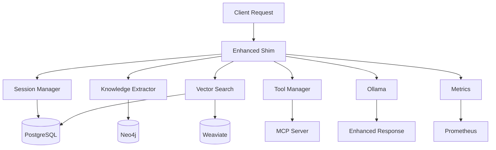

# Ollama Enhanced API Shim - Integration Guide

## Overview

This enhanced API shim transforms your Ollama instance into an intelligent AI agent system by seamlessly integrating with your entire AI infrastructure stack. Every Ollama API call is augmented with:

## Core Capabilities

### 🧠 Conversational Memory
- **PostgreSQL + pgvector**: Stores conversation history with semantic embeddings
- **Automatic similarity search**: Finds relevant past conversations
- **Context preservation**: Maintains conversation state across sessions
- **Smart memory management**: Automatically prunes old conversations

### 🕸️ Knowledge Graph Integration
- **Neo4j storage**: Automatically extracts and stores entities/relationships
- **Entity linking**: Connects related concepts across conversations
- **Relationship mapping**: Builds knowledge networks from interactions
- **Contextual retrieval**: Provides relevant entities for current conversation

### 🔍 Vector Search Capabilities
- **Dual vector stores**: Uses both Weaviate and Supabase pgvector
- **Semantic search**: Finds conceptually similar content
- **Embedding caching**: Optimizes performance with cached embeddings
- **Multi-modal support**: Ready for text, image, and audio embeddings

### 🛠️ Tool Integration
- **MCP Protocol**: Standardized tool access for AI agents
- **Automatic tool detection**: Recognizes when tools are needed
- **Tool result integration**: Incorporates tool outputs into responses
- **Extensible framework**: Easy to add new tools

### 📊 Comprehensive Monitoring
- **Prometheus metrics**: Detailed performance and usage metrics
- **Health monitoring**: Real-time service health checks
- **Request tracing**: Track request flow through all components
- **Resource monitoring**: Memory, CPU, and database usage

### Resource monitoring & Request Queue
- **** 
- **x**
- **Task Queuing**
- **Load Monitoring**

## Architecture Flow



## Request Processing Pipeline

1. **Request Interception**: All Ollama API calls are captured
2. **Session Management**: Conversation context is loaded/created
3. **Memory Search**: Relevant past conversations are retrieved
4. **Entity Extraction**: Knowledge entities are identified and stored
5. **Context Augmentation**: System prompt is enhanced with context
6. **Tool Detection**: Required tools are identified and prepared
7. **Ollama Forwarding**: Enhanced request is sent to Ollama
8. **Response Processing**: Response is analyzed and stored
9. **Knowledge Update**: New entities and relationships are stored
10. **Metrics Recording**: Performance metrics are updated

## API Compatibility

### Standard Ollama Endpoints
All standard Ollama endpoints are fully supported with enhanced capabilities:

- `POST /api/generate` - Enhanced with memory, knowledge, and tools
- `POST /api/chat` - Conversational interface with full context
- `GET /api/tags` - Lists available models (passthrough)
- `POST /api/pull` - Model management (passthrough)
- `POST /api/push` - Model management (passthrough)
- `POST /api/show` - Model details (passthrough)
- `POST /api/embeddings` - With caching and optimization

### Enhanced Endpoints
Additional endpoints for advanced functionality:

- `GET /api/shim/health` - System health and service status
- `GET /api/shim/sessions` - Active conversation sessions
- `GET /api/shim/sessions/{id}` - Session details and history
- `DELETE /api/shim/sessions/{id}` - Session cleanup
- `GET /api/shim/search` - Knowledge base search
- `POST /api/shim/tools/{name}` - Manual tool invocation
- `GET /metrics` - Prometheus metrics endpoint

## Integration with Your Stack

### Supabase Integration
- **Authentication**: Leverages Supabase Auth for user management
- **Database**: Uses Supabase PostgreSQL for conversation storage
- **Vector Search**: Utilizes pgvector extension for embeddings
- **Real-time**: Can leverage Supabase Realtime for live updates

### Neo4j Knowledge Graph
- **Entity Storage**: Automatic extraction and storage of entities
- **Relationship Mapping**: Builds connections between concepts
- **Graph Queries**: Complex relationship queries for context
- **Knowledge Evolution**: Tracks how knowledge changes over time

### Weaviate Vector Database
- **Semantic Search**: Advanced vector similarity operations
- **Multi-modal**: Ready for text, image, and audio vectors
- **Scalability**: Handles large-scale vector operations
- **Graph Integration**: Can link with Neo4j entities

### Workflow Integration
- **n8n Workflows**: Trigger workflows based on conversation events
- **Flowise Integration**: Use as enhanced LLM provider in flows
- **Webhook Support**: Send events to external systems

### Monitoring Integration
- **Grafana Dashboards**: Pre-built dashboards for visualization
- **Prometheus Metrics**: Comprehensive performance tracking
- **Alert Manager**: Set up alerts for system issues
- **Log Aggregation**: Structured logging for debugging

## Configuration Options

### Feature Toggles
```env
ENABLE_KNOWLEDGE_GRAPH=true    # Neo4j entity extraction
ENABLE_VECTOR_SEARCH=true      # Semantic search capabilities
ENABLE_MEMORY=true             # Conversation history
ENABLE_TOOLS=true              # MCP tool integration
ENABLE_CACHING=true            # Response and embedding cache
```

### Performance Tuning
```env
MAX_CONTEXT_TOKENS=8192        # Maximum context size
SIMILARITY_THRESHOLD=0.7       # Vector similarity cutoff
MAX_MEMORY_ENTRIES=50          # Messages to keep in memory
MAX_CONCURRENT_REQUESTS=10     # Request concurrency limit
```

### Database Configuration
```env
DB_POOL_MIN_SIZE=5            # Minimum DB connections
DB_POOL_MAX_SIZE=20           # Maximum DB connections
CACHE_TTL=3600                # Cache expiration time
```

## Usage Examples

### Basic Enhanced Chat
```bash
curl -X POST http://localhost:8082/api/generate \
  -H "Content-Type: application/json" \
  -H "X-Session-ID: user-123" \
  -d '{
    "model": "llama2",
    "prompt": "What did we discuss about machine learning yesterday?",
    "stream": false
  }'
```

### Knowledge Search
```bash
curl "http://localhost:8082/api/shim/search?q=neural%20networks&session_id=user-123&limit=5"
```

### Session Management
```bash
# Get session history
curl "http://localhost:8082/api/shim/sessions/user-123"

# Delete session
curl -X DELETE "http://localhost:8082/api/shim/sessions/user-123"
```

## Metrics and Monitoring

### Key Metrics
- `ollama_shim_requests_total` - Total requests processed
- `ollama_shim_request_duration_seconds` - Request latency
- `ollama_shim_active_sessions` - Active conversation sessions
- `ollama_shim_kg_operations_total` - Knowledge graph operations
- `ollama_shim_vector_searches_total` - Vector search operations
- `ollama_shim_memory_operations_total` - Memory operations
- `ollama_shim_tool_usage_total` - Tool invocation count
- `ollama_shim_cached_embeddings` - Cached embeddings count

### Grafana Dashboard
Import the provided dashboard from `monitoring/grafana/dashboards/ollama-shim-dashboard.json` to visualize:
- Request rates and response times
- Knowledge graph activity
- Vector search performance
- Tool usage patterns
- System health indicators

## Performance Considerations

### Memory Usage
- Embedding models require 1-2GB RAM
- Conversation cache grows with active sessions
- Vector operations can be memory-intensive

### Storage Requirements
- PostgreSQL: ~100MB per 1000 conversations
- Neo4j: ~50MB per 1000 entity relationships
- Weaviate: ~1KB per embedding vector

### Scalability
- Horizontal scaling via load balancer
- Database connection pooling
- Embedding cache sharing via Redis
- Vector database sharding

## Security Considerations

### Access Control
- Session-based isolation
- JWT token validation (if using Supabase Auth)
- Rate limiting on API endpoints
- Tool access restrictions

### Data Privacy
- Conversation data encryption at rest
- Secure inter-service communication
- Audit logging for sensitive operations
- GDPR compliance features (data deletion)

## Troubleshooting

### Common Issues
1. **High latency**: Check embedding model cache hits and database connection pool
2. **Memory errors**: Reduce MAX_MEMORY_ENTRIES or embedding model size
3. **Database connection failures**: Verify credentials and connection strings
4. **Knowledge graph errors**: Check Neo4j accessibility and authentication
5. **Vector search timeouts**: Increase timeout values or reduce search scope
6. **Tool invocation failures**: Verify MCP server is running and accessible

### Health Check Diagnostics
```bash
# Check overall system health
curl http://localhost:8082/api/shim/health

# Check individual service connectivity
docker logs ollama-enhanced-shim

# Monitor resource usage
docker stats ollama-enhanced-shim
```

### Performance Optimization
1. **Enable embedding cache**: Set ENABLE_CACHING=true
2. **Tune similarity threshold**: Adjust SIMILARITY_THRESHOLD (0.6-0.8)
3. **Optimize memory entries**: Balance MAX_MEMORY_ENTRIES vs performance
4. **Database tuning**: Adjust connection pool sizes
5. **Vector index optimization**: Configure Weaviate/pgvector indexes

### Debugging Steps
1. Check service dependencies are running
2. Verify environment variables are set correctly
3. Monitor logs for specific error messages
4. Test individual components (DB, Neo4j, Weaviate)
5. Use health endpoints to isolate issues

## Migration from Standard Ollama

### Step-by-Step Migration
1. **Backup existing data**: Export any important conversations
2. **Deploy shim**: Start the enhanced shim service
3. **Update API endpoints**: Change client URLs to shim endpoint
4. **Test functionality**: Verify all features work correctly
5. **Monitor performance**: Check metrics and adjust configuration

### Client Changes Required
```javascript
// Before - Direct Ollama
const response = await fetch('http://localhost:11434/api/generate', {
  method: 'POST',
  headers: { 'Content-Type': 'application/json' },
  body: JSON.stringify({ model: 'llama2', prompt: 'Hello' })
});

// After - Enhanced Shim
const response = await fetch('http://localhost:8082/api/generate', {
  method: 'POST',
  headers: { 
    'Content-Type': 'application/json',
    'X-Session-ID': 'user-session-123'  // Optional but recommended
  },
  body: JSON.stringify({ model: 'llama2', prompt: 'Hello' })
});
```

### Compatibility
- **100% backward compatible** with existing Ollama clients
- **No breaking changes** to API responses
- **Optional enhancements** activated via headers or configuration
- **Gradual adoption** possible - start with basic passthrough

## Advanced Use Cases

### Multi-Agent Conversations
```bash
# Agent 1
curl -X POST http://localhost:8082/api/generate \
  -H "X-Session-ID: agent-conversation-1" \
  -d '{"model": "llama2", "prompt": "As a research assistant, what should we investigate about quantum computing?"}'

# Agent 2
curl -X POST http://localhost:8082/api/generate \
  -H "X-Session-ID: agent-conversation-1" \
  -d '{"model": "mistral", "prompt": "As a technical writer, how should we document our quantum computing research?"}'
```

### Knowledge Graph Queries
```bash
# Find related concepts
curl "http://localhost:8082/api/shim/search?q=quantum%20computing&session_id=agent-conversation-1"

# Get entity relationships
curl "http://localhost:8082/api/shim/graph/entities?name=quantum%20computing"
```

### Workflow Integration
```bash
# Trigger n8n workflow based on conversation
curl -X POST http://localhost:8082/api/shim/workflows/trigger \
  -d '{"workflow": "summarize-conversation", "session_id": "user-123"}'
```

## Best Practices

### Session Management
- Use consistent session IDs for users
- Implement session cleanup policies
- Monitor session memory usage
- Consider session expiration

### Performance Optimization
- Cache frequently accessed embeddings
- Use connection pooling for databases
- Monitor and tune similarity thresholds
- Implement request rate limiting

### Security
- Validate all user inputs
- Implement proper authentication
- Use secure connections between services
- Regular security audits and updates

### Monitoring
- Set up alerts for service failures
- Monitor response times and error rates
- Track resource utilization trends
- Regular health check validations

## Future Enhancements

### Planned Features
- Multi-modal support (images, audio)
- Advanced reasoning chains
- Federated learning across sessions
- Enhanced tool ecosystem
- Real-time collaboration features

### Extension Points
- Custom embedding models
- Additional vector databases
- External knowledge sources
- Advanced reasoning algorithms
- Custom tool protocols

## Support and Community

### Documentation
- API documentation: `/docs` endpoint (when running)
- Metrics documentation: `/metrics` endpoint
- Health check details: `/api/shim/health`

### Logs and Debugging
```bash
# View real-time logs
docker logs -f ollama-enhanced-shim

# Enable debug logging
docker-compose restart ollama-enhanced-shim -e LOG_LEVEL=DEBUG
```

### Configuration Validation
The shim validates configuration on startup and provides clear error messages for misconfigurations. Check the logs for detailed validation results.

This enhanced Ollama API shim transforms your basic LLM into a sophisticated AI agent system with persistent memory, knowledge graphs, and tool integration - all while maintaining full compatibility with existing Ollama clients.